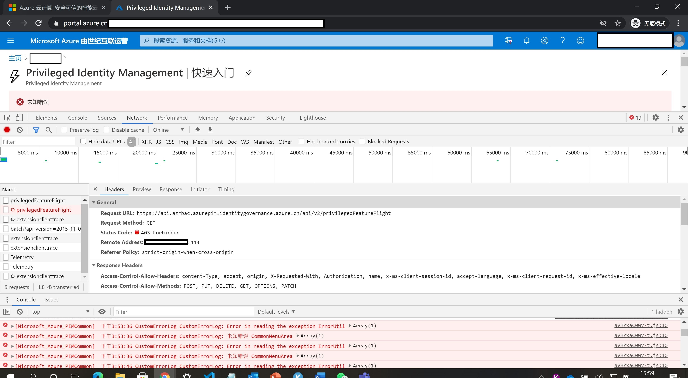

# LopNor
复刻罗布泊，自由驰骋的路上，乐于互助，问题分享。

#问题1：启用 Azure PIM 报 “未知错误” 无法使用。

环境：azure.cn

解决过程：
2021年1月22日21V 提工单，工程师远程帮抓了web trace，发给PG分析。
2021年1月28日工程师告诉我问题已修好，测试没问题，关闭工单。

原因：
第一次启用PIM的时候，PIM需要check每个tenant的cloud instance.
For azure.cn:PIM的判断依据是AAD认证服务,返回一个value是不是chinacloudapi.cn，不过AAD认证服务最近返回的是partner.onmschina.cn，导致PIM判断失败，后面onboard也做不了。

感谢后台工程师朋友的支持。
